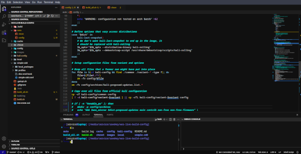

# dave0xe7_vscode_style

## my vscode color theme extension  

## For more information

* [VSCode extension guide on color-themes](https://code.visualstudio.com/api/extension-guides/color-theme#_create-a-new-color-theme)